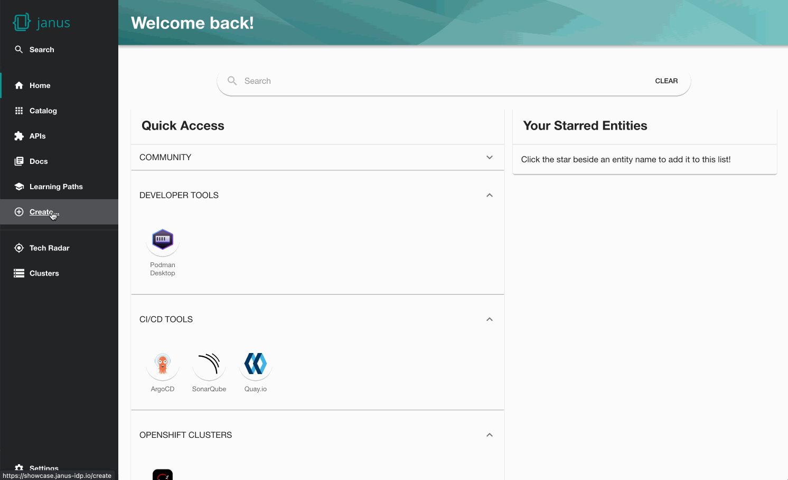

# Software Templates

Collection of Software Templates / Golden Path for Red Hat Developer Hub.

> NOTE: some of the Templates available in this collection relies on [**Hashicorp Vault**](https://www.vaultproject.io/) to manage Secrets (eg. Github and Quay access tokens). 

Two additional Secret Engine plugins are required to be installed and enabled on Vault Server:

 * [vault-plugin-secrets-github](https://github.com/martinbaillie/vault-plugin-secrets-github)
 * [vault-plugin-secrets-quay](https://github.com/redhat-cop/vault-plugin-secrets-quay/)

These Secret Engines can create access tokens dynamically on Github and Quay using its APIs and store them in Vault.

> after installing these two Secret Engine Plugins into Vault server you can enable them by:
```sh
vault secrets enable -address https://vault.vault.svc:8200 -path=github vault-plugin-secrets-github
vault secrets enable -address https://vault.vault.svc:8200 -path=quay vault-plugin-secrets-quay
```

In order to automate the secrets provisioning these templates generates some Custom Resources (CRDs) that requires the following Operators to be present in the cluster where the application gets deployed to:

 * [Vault Config Operator](https://github.com/redhat-cop/vault-config-operator)
 * [Git Webhook Operator](https://github.com/redhat-cop/gitwebhook-operator)

The Custom Resources in these templates also expect the following secrets to be present in your Vault instance

```
path: kv/secrets/rhdh/github-plugin
data:
  app_id: '...' #Github App Id
  org: '...' #Github Org name
  key: '...' #Github App Private Key (.pem file content)
```

and 

```
path: secrets/rhdh/registry-plugin
data:
  username: '...' #Quay account name
  password: '...' #Quay oauth token with Administrative Permissions to manage repos and create new accounts
```

> If you don't have Hashicorp Vault setup on your environment you can switch over to the `no-vault` branch which does not use Vault integration.

> NOTE: you can install/setup a `RHDH + Hashicorp Vault` environment on your **sandbox cluster** using [**this repo here**]( https://github.com/redhat-na-ssa/redhat-developer-hub-gitops-bootstrap.git ). This repo contains a ArgoCD app which install all the components needed to use these software templates. I also contains a Ansible playbook to install RHDH and configure Vault.

## Using the Template Editor UI

While implementing or customizing your own Software Template you can leverage 
the Template functionality available in the UI. See below how to access it.



> NOTE: make sure you choose 'Load from a directory' to load this git repo from your local file system and point it to the root of this repo. Any change you make using the web editor will base saved only in your file system.